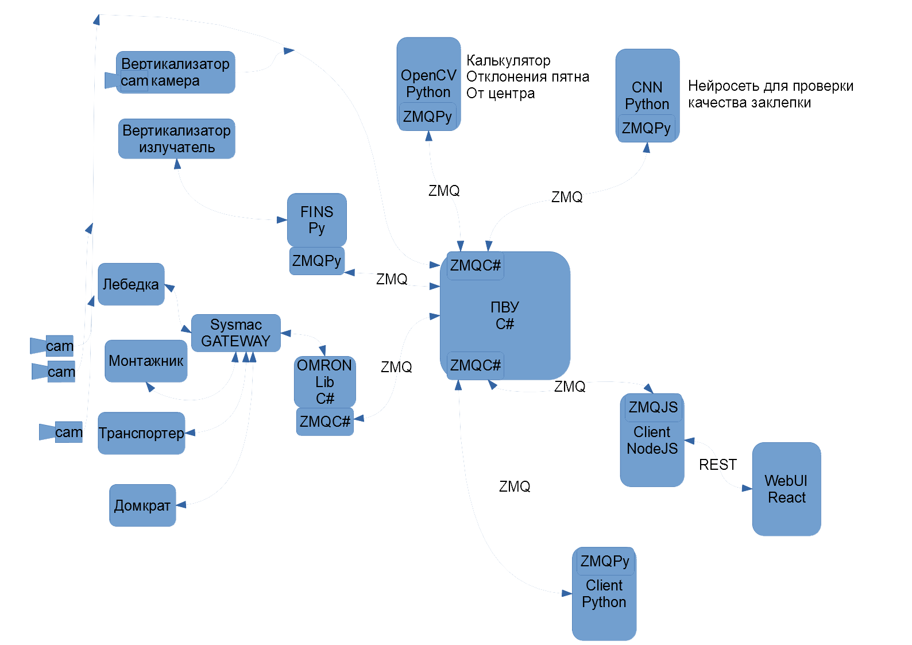

# TopLevelProgram
Весь этот комплекс в конечном счете должен выполнять такие задачи:
  - гибкая и надежная система управления стройкой объекта на двадцатке
  - управление заданиями всех манипуляторов присутствующих на объекте
  - отображение текущего состояния стройки в веб-интерфейсе. Хотелось бы параллельно отображать и в 3D
  - тестирования всего алгоритма строительства и отдельных его частей без привязки к реальным манипуляторам
  - реализация задач по визуальной оценке качества выполненных манипуляторами подзадач (заклепывание, позиционирование)

Это корневая директория нашего проекта.
Здесь расположены: 
  - ПВУ (MainApp) - программа, реализующая основной алгоритм стройки (в данный момент алгоритм пустой), и взаимодействующая со всеми остальными компонентами через zmq-запросы.
  - модуль (json_converter) для согласованного взаимодействия различных компонентов через zmq-запросы. Внутри он содержит пакет для python и библиотеку классов для C#
  - cnn_service - компонент реализующий обработку изображения нейросетью и детектирования на ней заклепки
  - py_client - служебный клиент, который в данный момент используется как самый простой способ провзаимодействовать с ПВУ
  
На схеме ниже показано, как между собой соотносятся разные его компоненты

### Модуль контроля качества заклёпки

**Функционал:** принимает на вход картинку, обрабатывает её нейросетью, возвращает обработанную картинку и ключевые параметры обработки (обнаруженные объекты, достоверность, качество произведённой операции и т.д.)

**Как и с кем взаимодействует:** принимает запросы по каналу ZMQ в формате, описанном в подмодуле json_coder от программы высокого уровня. Возвращает результаты в ПВУ для использования параметров обработки в алгоритме ПВУ и дальнейшего сохранения обработанной и необработанной картинки в архив.

### Модуль расчета смещения пятна вертикализатора (OpenCV Python)

**Функционал:** Принимает на вход картинку, обрабатывает ее с помощью библиотеки OpenCV, возвращает координаты пятна лазера.

**Как и с кем взаимодействует:** Принимает запросы по каналу ZMQ в формате, описанном в подмодуле json_coder от ПВУ (программы высокого уровня). Возвращает результат в ПВУ для использования рассчитанных значений для управления позиционированием силовой рамы домкратами. Также эти значения сохраняются в архив.

### Клиент для быстрой настройки ПВУ Client Python

**Функционал:** Этот клиент содержит в себе последовательность запросов к ПВУ. Служит для автоматизации тестирования алгоритма. Таких клиентов может быть множество различных.

**Как и с кем взаимодействует:** По каналу ZMQ посылает запросы к ПВУ. Принимает ответ, если требуется как-то его обрабатывает.

### WebServer (Client node.js)

**Функционал:** Этот клиент служит прослойкой между функционалом ПВУ и WebUI. Он отвечает за доступ к функционалу ПВУ через REST запросы. Если смотреть со стороны паттернов проектирования, то это Controller в паттерне MVC (Model-View-Controller). Другими словами - отделяет нюансы представления от логики основной программы. Этот клиент постоянно запущен в качестве сервера и обрабатывает web запросы.

**Как и с кем взаимодействует:** Принимает REST запросы от WebUI, на их основе формирует запросы к ПВУ и посылает их по каналу ZMQ. Ответ от ПВУ преобразует в удобный для отображения на стороне пользователя вид и возвращает ответ WebUI.

### WebUI React. Пользовательский веб интерфейс.

**Функционал:** Позволяет пользователю в браузере просматривать состояние ПВУ, архив работы, повлиять на ход алгоритма ВПУ и сконфигурировать его, не прибегая к “программированию”.
Представляет собой несколько web страниц с разными разделами управления, с таблицами переменных, с каким-то представлением алгоритма и текущей позиции на нем стройки в целом и каждого отдельного манипулятора. Тут же можно смотреть видео с камер.

**Как и с кем взаимодействует:** Взаимодействует напрямую с пользователем, отправляет web запросы к WebServer-у, изменяет свое состояние в зависимости от полученного ответа. Скорее всего также имеет прямой доступ к IP камерам.

### Omron Lib C#. Обертка библиотеки для связи через Sysmac Gateway

**Функционал:** Предоставляет значения переменных манипуляторов в удобном формате для работы с ними внутри ПВУ. Актуализирует значения по таймеру. Предоставляет доступ к записи переменных манипуляторов. Список переменных в себе не хранит - конфигурируется через JSON файлы конфигурации при запуске. Через ZMQ запросы в процессе работы другими сервисами устанавливает таймеры для обновления значений различных переменных. 

**Как и с кем взаимодействует:** Принимает запросы по каналу ZMQ от ПВУ, по которым конфигурирует периоды обновления переменных манипуляторов. По тому же каналу ZMQ принимает запросы на доступ к переменным. Через API в виде библиотеки от OMRON связывается с SysmacGATEWAY и работает с переменными манипуляторов.

### FINS Py. FINS клиент.

**Функционал:** Функционал такой же, как и у обертки для связи через Sysmac Gateway, но с контроллером связывается по FINS протоколу. 

**Как и с кем взаимодействует:** Принимает запросы от ПВУ по каналу ZMQ. Возвращает по этому же каналу значения переменных. По каналу FINS связывается с ПЛК манипуляторов, которые не поддерживаются Sysmac Gateway.

### Sysmac Gateway

**Функционал:** Предоставляет доступ к переменным ПЛК

**Как и с кем взаимодействует:** Через API предоставляемое в виде библиотеки позволяет манипулировать переменными в ПЛК. Работает на компьютере, где запущен сервис Omron Lib C#. И через сеть связывается с контроллерами.

### ПВУ, программа верхнего уровня

**Функционал:** Реализует (проигрывает) алгоритм стройки. Реализует гибкую конфигурацию этого алгоритма. Логгирует все нужные данные в базу данных. 
Внутри себя содержит модели манипуляторов, актуализированные с настоящими манипуляторами. Управляет этими моделями давая им команды (например вызывая методы). Модели в свою очередь при вызове методов изменяют свое внутреннее состояние и изменяют соответствующим образом переменные в настоящих манипуляторах. 

**Как и с кем взаимодействует:** Слушает по каналу ZMQ команды, оценивает их на адекватность в данный момент и выполняет, если они адекватны, или отвечает ошибкой. Также на определенных шагах алгоритма или по запросу по ZMQ передает на анализ изображения с видеокамер сервисам, которые эти изображения обрабатывают. По ZMQ взаимодействует и с другими сервисами, в том числе для актуализации переменных манипулятора.

### json_coder Модуль для упаковки объектов при межпроцессном взаимодействии.

**Функционал:** В этом модуле реализован функционал упаковывания и распаковывания объектов определенных классов в JSON-строку. Картинки упаковываются в utf8-строку base64 представления .png картинки. К .png и обратно приводятся cv:Mat с форматом цвета rgb uint8.

**Как и с кем взаимодействует:** Подключается прямо в код многих сервисов проекта и реализует передачу данных, в том числе картинок, между процессами.

