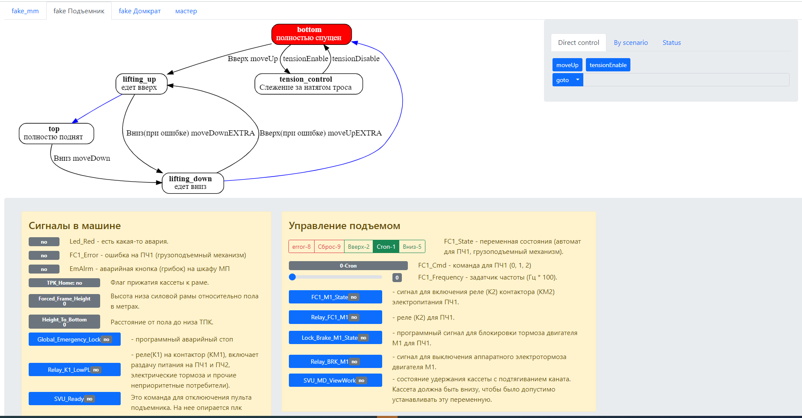
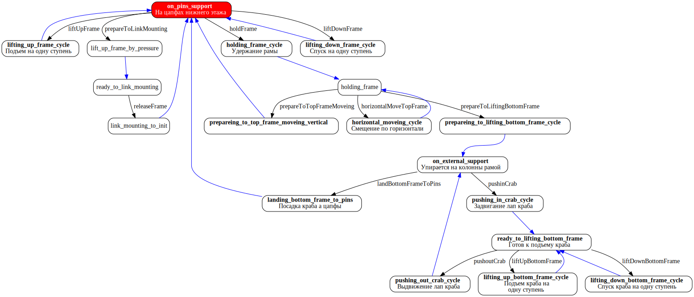
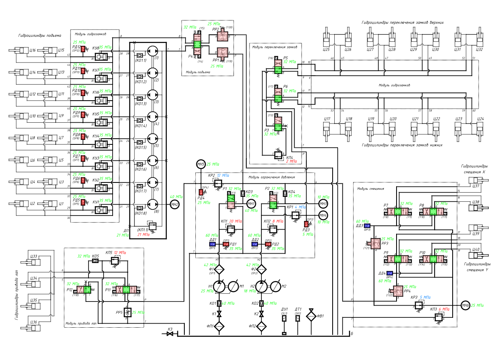
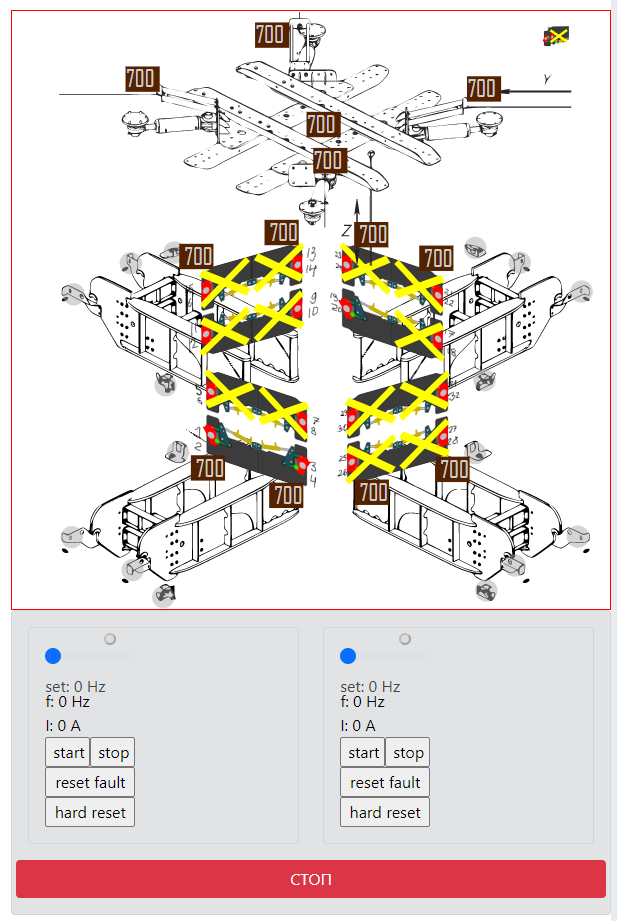
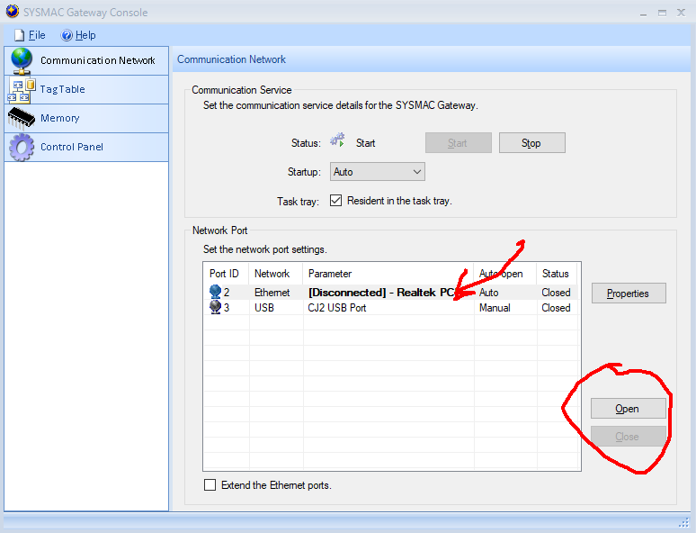

# Machine Scripting

Это основной репозиторий программы управления стройкой, разработанной в энергозапасе.  
Для строительства накопителя требуется координированно управлять несколькими автоматическими машинами. Именно эту задачу выполняет данный проект.

На главной странице интерфейса расположены

- вкладки машин задействованных в стройке
- схема состояний выбраной машины
- справа панель возможных переходов и переходов по сценариям
- внизу панель непосредственного управления пеханизмом на уровне переменных ПЛК. Она индивидуальная для каждой машины.

Общий вид  

Схема переходов манипулятора домкрата  

Интерактивная гидросхема домкрата  

Панель управления насосами домкрата (внизу) и отображение показаний датчиков положения замков и других.  

## Структура проекта

### ПЛК (firmware)

- ПО манипулятора домкрата (mm_domkrat)

### ПК сервисы

- Логика (machine_scripting):
  - Web UI (clients/react)
  - shared - разделяемые файлы бэка и фронта, ts
  - backend (node, ts)
    - zmq
    - express
    - javascript-state-machine
    - graphviz
- PLC connector - модуль связи с ПЛК через SysmacGateway
- NeuroNets_MM - модуль распознования дефектов заклепывания (автор Куваев Олег)

#### Описание устройства проекта

Связь ПК и ПЛК осуществляется через проприентарный SysmacGateway (по факту внутри него интерфейс общения с ПЛК **CIP**). Для общения с SysmacGateway Omron предоставляет библиотеку для .NET (VB или C#), называемую CX-Compolet.

Был написан сервис (PLC connector) для .NET на C# транслирующий запросы из ZeroMQ в методы этой библиотеки для чтения shared переменных ПЛК. Этот сервис допустимо запускать в нескольких экземплярах.

На Node был написан сервис транслятор из HTTP запросов в ZMQ для управления переменными из веб интерфейса.

Далее для node.js был написан сервис (контроллер состояний), позволяющий влиять на переменных в ПЛК строго по правилам, определяемым графом состояний машины. Таким образом была вынесена верхнеуровневая логика из ПЛК в программу для ПК.
Этот сервис взаимодействуетс с сервисом PLC connector через ZMQ.
Граф состояний машины задается исходя из требованияй библиотеки javascript-state-machine.
Визуализация графа состояний реализована в той же библиотеке с использованием graphviz.
Сервис предоставляет REST API. Стоит сразу сказать, что решение по реализации этого АПИ далеко не лучшее, следовало воспользоваться каким-нибудь стандартным подходом. Тем не менее, благодаря разделяемым типам бэкенда и фронтенда удалось добиться типизации ответов на запросы.
Этих сервисов можно запускать множество параллельно, каждый будет отвечать за свою машину.  
Там же введена возможность управления не ПЛК, а набором точно таких же сервисов. Таким образом реализуется логика управления самим процессом стройки. Главный граф управляет переходами дочерних графов, которые управляют переменными в своих ПЛК - все машины движутся скоординировано.

Для управления и отображения текущими процессами на стройке был реалирован web интерфейс на React. Основная и исходная задача этого интерфейса была в отображении графа состояний каждой из машин, с пометкой активного состояния и предоставляющего возможность передавать команды контроллеру состояний.  
Позднее к этому интерфейсу были добавлены панели управления индивидуальные для машин. Эти панели взаимодействуют с сервисом транслятором.

Панель манипулятора домкрата представляет из себя интерактивную гидросхему. Она реализована с использованием утилиты svgr, которая позволяет создавать react-компонент из svg-изображения. Таким образом элементы изображения становятся кликабельными и доступными для других компонентов реакт. Для автоматического преобразования был использован и доработан один из плагинов для svgr, который к сожалению потерялся.

Панель управления манипулятором монтажником отображает входную и выходную информацию нейросети, оценивающей качество заклепывания связи с лепестком колонны.

Для манипулятора монтажника заведен еще один сервис NeuroNets_MM (автор Куваев Олег). К этому сервису обращается помимо веб-интерфейса еще и контроллер состояний при переходе между шагами "заклепывание" и "возвращение в исходную позицию", выдавая аварию в случае плохого результата от нейросети.

## Инструкции по развертыванию

### Зависимости

Архив с зависимостями находится в папке **dependences**

Для комфортной работы требуется установить
свежий **Powershell**, **git**, модуль **posh-git** ниже
инструкция.

    PowerShellGet\Install-Module posh-git -Scope CurrentUser -Force

    Add-PoshGitToProfile -AllHosts

Устанавливаем `К6СМ\Framework\dotnetfx35.exe`

Далее устанавливаем `SysmacGateWay` - программу для связи с контроллерами Omron. Для этого запускаем `К6СМ\SGW\Disk1\setup.exe`

Появится файл
`C:\Program Files (x86)\OMRON\SYSMAC Gateway\bin\CIPCoreConsole.exe`  
Для удобства делаем ссылку на этот файл в доступном месте. При запуске системы для связи с манипуляторами требуется в этой программе настроить подключение.

После перезагрузки удается настроить подключение.

Устанавливаем **dotnet** (.NET Core 3.1 SDK)(dotnet-sdk-3.1.414-win-x64.exe)
Устанавливаем **dotnet framework 4.8 sdk** (ndp48-devpack-enu.exe)

Устанавливаем **К6СМ\CX-Compolet\Disk1\setup.exe**

После этого у нас должен запускаться самописаный сервис для связи с контроллерами **PLC connector**. Он будет запускаться при запуске приложения с настройками для реальных машин.

Устанавливаем **nodejs** node-v14.18.1-x64.msi, либо более свежий.

устанавливаем **graphviz** (for all users)

### Установка основного окружения

Для создания symlink в win10 требуется включить разрешения в системе.

Чтобы SysmacStudio имел доступ к проекту домкрата, требуется
в корне проекта в powershell исполнить следующую команду:

    New-Item -Path C:\OMRON\Data\Solution\mm_domkrat -ItemType SymbolicLink -Target $(Convert-Path .\firmware\mm_domkrat)

Для запуска nodejs сервисов требуется создать symlink на разделяемые бэком и фронтом части проекта.
Для этого из `services\machine_scripting\clients\react\src` надо выполнить

    New-Item -Path .\shared -ItemType SymbolicLink -Target $(Convert-Path ..\..\..\shared)

В backend и в клиенте запускаем `npm i` для установки модулей.

    cd services\machine_scripting\backend
    npm i
    cd services\machine_scripting\clients\react
    npm i

### Запуск

Запускаем бэкенд

    cd services\machine_scripting\backend
    npm run startup

и фронтенд

    cd services\machine_scripting\clients\react
    npm start
